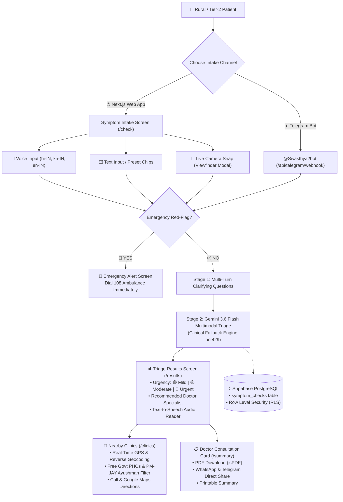

# SwasthyaSaathi (स्वास्थ्य साथी / ಸ್ವಾಸ್ಥ್ಯ ಸಾಥಿ)
### AI Health Symptom-to-Action Companion for Rural & Tier-2 India

[](https://nextjs.org/)
[](https://www.typescriptlang.org/)
[](https://tailwindcss.com/)
[](https://ai.google.dev/)
[](https://supabase.com/)
[](https://t.me/Swasthya2bot)
[](https://www.openstreetmap.org/)

---

## 🌟 Overview & Problem Statement

Millions of people in rural and semi-urban India delay seeking medical care because they don't know how serious their symptoms are, which doctor to consult, or where to find an affordable clinic nearby. Language barriers, low health literacy, and lack of specialist access compound the problem, leading to preventable complications and financial distress.

**SwasthyaSaathi** bridges this critical gap. Designed specifically for low-bandwidth, mobile-first environments, it allows patients or community health workers (ASHA/ANM) to describe symptoms by voice or camera in their native language (**Hindi**, **Kannada**, or **English**), receive an instant clinical urgency check, find nearby **Free Government PHCs** and **Ayushman Bharat (PM-JAY)** hospitals, and generate a structured **Doctor Consultation Card** that eliminates the need to repeatedly explain symptoms.

---

## ✨ Key Features

### 1. 🎤 Multilingual Voice-First Intake
- **Web Speech API with Fallback**: Speak naturally in **Hindi (`hi-IN`)**, **Kannada (`kn-IN`)**, or **English (`en-IN`)**.
- **Real-Time Audio Waveform**: Visual bouncing soundwave cues give clear feedback while speaking.
- **One-Tap Symptom Presets**: Instant cards for common rural ailments (Fever, Cough, Headache, Stomach Pain, Rash, Infant Fever, Chest Pain).
- **Dual Intake Modes**: Seamlessly toggle between voice recording and text input.

### 2. 📸 Live In-App Camera Viewfinder (Multimodal Vision)
- **Real-Time Viewfinder**: Uses `navigator.mediaDevices.getUserMedia` for instantaneous in-app symptom photography.
- **Front & Rear Camera Switcher**: Single-tap toggle to flip between back camera (ideal for skin rashes, wounds, and burns) and selfie camera (ideal for eye redness or facial symptoms).
- **Target Guidelines**: Visual centering box overlay guides rural patients to frame affected areas properly.
- **Client-Side Image Freezing & Compression**: Frames are frozen to an HTML5 canvas and downscaled to $\le 1024\text{px}$ JPEG (150–250KB), keeping network consumption minimal for 2G/3G connectivity.
- **Visual Inspection with Gemini Vision**: AI inspects rash distribution, wound depth, and inflammation alongside verbal descriptions.

### 3. 🧠 2-Stage Clarifying Questions (Multi-Turn Triage)
- Rather than an immediate single-turn triage, SwasthyaSaathi dynamically generates **1 to 2 simple, conversational clarifying questions** (e.g. *"Do you also have chills or shivering?"*) with quick options (*Yes*, *No*, *Not sure*).
- Incorporates patient clarifications for maximum clinical precision before finalizing doctor recommendations.

### 4. 📍 Real-Time GPS & Public Health Scheme Navigator
- **High-Accuracy Real-Time GPS**: Samples device sensors with `enableHighAccuracy: true` and maximum freshness (`maximumAge: 0`) for $\pm 10\text{–}15\text{m}$ accuracy.
- **Automated Reverse Geocoding**: Automatically translates coordinates into readable locality names (e.g., *"Ashokanagar, Bengaluru"*, *"Indira Nagar, Lucknow"*).
- **Village, Town & PIN Code Search**: Search any Indian village, district, or PIN code with live autocomplete suggestions.
- **Public Healthcare Scheme Filters**:
  - 🏛️ **Govt PHC / CHC / Hospital (Free OPD)**: Primary Health Centres and Civil Hospitals.
  - 💳 **Ayushman Bharat (PM-JAY)**: Empanelled network hospitals providing cashless treatment under the Golden Card.
  - 💊 **Pradhan Mantri Jan Aushadhi Kendras**: Generic pharmacies offering up to 90% savings on essential drugs.
- **One-Tap Actions**: Direct `Call` button and Google Maps `Directions` navigation.
- **Adjustable Search Radius**: Toggle between **5 km**, **10 km**, and **20 km** to find medical facilities in both cities and remote districts.

### 5. ✈️ 24x7 Telegram Health Bot (`@Swasthya2bot`)
- **Direct Telegram Channel**: Triage symptoms directly inside Telegram without downloading any app: [https://t.me/Swasthya2bot](https://t.me/Swasthya2bot).
- **Native Keyboard Navigation**: One-tap reply buttons (`[ 🩺 Check Symptoms ]`, `[ 🚨 Emergency (108) ]`, `[ ℹ️ Help / मदद ]`).
- **High-Reliability Clinical Fallback Engine**: If Google Gemini encounters rolling rate limits or quota exhaustion, SwasthyaSaathi automatically engages a clinical rule-based triage engine to extract symptoms and deliver empathetic advice in English, Hindi, or Kannada. **The bot never crashes or stays silent.**
- **Automatic Database Logging**: All Telegram triage events are recorded in Supabase PostgreSQL tables.

### 6. 📋 Doctor Summary Card & Multi-Channel Sharing
- **Pre-Consultation Card**: Formats urgency level, detected symptoms, duration, patient's exact words, clarifying answers, attached photo thumbnail, and AI rationale.
- **Download PDF**: Generates offline-accessible medical summaries using `jsPDF` and `jspdf-autotable`.
- **Multi-Channel Sharing**: One-tap direct sharing to **WhatsApp**, **Telegram**, and native system share.
- **Print Friendly**: Built-in print stylesheet for paper copies at rural clinics.

### 7. 🚨 Emergency Protocol Guard
- **Immediate Red-Flag Detection**: Pre-screened for critical emergencies (chest pain, shortness of breath, severe bleeding, stroke symptoms, loss of consciousness).
- **Dedicated Emergency Screen**: Full-screen red alert with one-tap dialing for the national **108 Free Ambulance Service** and nearest emergency room navigation.

### 8. 🔊 Accessibility & Text-to-Speech (TTS)
- Accessible audio reader reads AI recommendations aloud in Hindi, Kannada, or English for low-literacy users.
- Touch targets $\ge 48\text{px}$ across all mobile screens.

---

## 🏗️ Architecture & Patient Flow



---

## 🛠️ Tech Stack

| Component | Technology | Purpose |
| :--- | :--- | :--- |
| **Framework** | Next.js 14 (App Router) | High-performance React server/client rendering |
| **Styling** | Tailwind CSS | Mobile-first, responsive, accessible styling |
| **Language** | TypeScript 5.6 | Strict type-safety across all components & API routes |
| **AI Triage Engine** | Google Gemini 3.6 Flash | Multimodal symptom interpretation & specialist matching |
| **Database & Auth** | Supabase (PostgreSQL) | Secure symptom check history with Row Level Security |
| **Maps & Clinics** | OpenStreetMap Overpass & Nominatim | Free, real-time medical facility discovery & reverse geocoding |
| **PDF Generation** | jsPDF + jspdf-autotable | Client-side Doctor Consultation Card PDF export |
| **Voice Intake** | Web Speech API | Client-side voice recognition for Hindi, Kannada, and English |
| **Audio Playback** | Web SpeechSynthesis API | Text-to-speech audio reader for low-literacy users |
| **Live Camera** | HTML5 `getUserMedia` + Canvas | In-app viewfinder with client-side compression |
| **Messaging Channel**| Telegram Bot API | 24x7 chat-based triage via `@Swasthya2bot` |

---

## 📁 Directory Structure

```
SWASTHYA SATHI/
├── public/                     # Static assets, icons, manifest.json
├── scripts/
│   └── telegram-bot-runner.mjs # Local Telegram Bot polling runner
├── src/
│   ├── app/
│   │   ├── api/
│   │   │   ├── clinics/        # OpenStreetMap medical nodes API
│   │   │   ├── location/       # Reverse geocoding & Indian city search API
│   │   │   ├── telegram/       # Telegram bot webhook endpoint
│   │   │   └── triage/         # Gemini 3.6 Flash multimodal triage & questions
│   │   ├── check/              # Voice & camera intake screen (Step 1)
│   │   ├── clinics/            # Real-time GPS nearby facilities (Step 3)
│   │   ├── emergency/          # 108 Emergency ambulance alert screen
│   │   ├── results/            # AI triage assessment & TTS audio (Step 2)
│   │   ├── summary/            # Doctor consultation card & PDF export (Step 4)
│   │   ├── globals.css         # Tailwind global styles
│   │   ├── layout.tsx          # Root layout with PWA metadata
│   │   └── page.tsx            # Landing page & hero intake
│   ├── components/
│   │   ├── ClarifyingQuestionsModal.tsx # Multi-turn clarifying question modal
│   │   ├── ClinicCard.tsx               # Medical facility card with Call/Directions
│   │   ├── Disclaimer.tsx               # Medical disclaimer banner
│   │   ├── LanguageProvider.tsx         # React Context for trilingual state
│   │   ├── LanguageSelector.tsx         # English / हिंदी / ಕನ್ನಡ selector
│   │   ├── LiveCameraModal.tsx          # In-app real-time camera viewfinder
│   │   ├── LoadingSpinner.tsx           # Accessible loading indicator
│   │   ├── MicButton.tsx                # Pulsing animated microphone button
│   │   ├── PhotoUploadButton.tsx        # Camera snap & gallery picker
│   │   ├── TelegramBotCard.tsx          # 24x7 Telegram bot promotional card
│   │   └── UrgencyBadge.tsx             # Color-coded urgency pill (🟢/🟡/🔴)
│   ├── hooks/
│   │   ├── useGeolocation.ts   # Real-time GPS hook with reverse geocoding & IP fallback
│   │   └── useSpeechToText.ts  # Multilingual Web Speech API hook
│   ├── lib/
│   │   ├── clinics.ts          # Overpass API parser & Haversine distance calculator
│   │   ├── gemini.ts           # Gemini 3.6 Flash client + Clinical Fallback Engine
│   │   ├── i18n.ts             # Trilingual dictionaries (en, hi, kn)
│   │   ├── pdf.ts              # jsPDF Doctor Card generation
│   │   ├── redflags.ts         # Keyword emergency red-flag validator
│   │   └── supabase/           # SSR and client Supabase connectors
│   └── types/
│       └── index.ts            # TypeScript interfaces & types
├── .env.example                # Environment variables template
├── next.config.mjs             # Next.js configuration & HTTP security headers
├── package.json                # Project dependencies & scripts
├── tailwind.config.ts          # Tailwind CSS theme configuration
└── tsconfig.json               # TypeScript compiler configuration
```

---

## 🚀 Getting Started

### Prerequisites
- Node.js 18.17+ or 20+
- npm or yarn
- A Google Gemini API Key ([Google AI Studio](https://aistudio.google.com/))
- (Optional) A Supabase project for database logging ([Supabase](https://supabase.com/))
- (Optional) A Telegram Bot token from [@BotFather](https://t.me/BotFather)

### 1. Clone the Repository
```bash
git clone https://github.com/LALITHD-21/SwasthyaSaathi.git
cd SwasthyaSaathi
```

### 2. Install Dependencies
```bash
npm install
```

### 3. Configure Environment Variables
Copy the `.env.example` file to `.env.local`:
```bash
cp .env.example .env.local
```
Fill in your API credentials:
```env
# Google Gemini
GEMINI_API_KEY=your_gemini_api_key

# Supabase Database
NEXT_PUBLIC_SUPABASE_URL=https://your-project.supabase.co
NEXT_PUBLIC_SUPABASE_ANON_KEY=your_anon_key
SUPABASE_SERVICE_ROLE_KEY=your_service_role_key

# Telegram Bot Integration
TELEGRAM_BOT_TOKEN=your_bot_token_here
NEXT_PUBLIC_TELEGRAM_BOT_USERNAME=Swasthya2bot
```

### 4. Run the Development Server
```bash
npm run dev -- -p 3001
```
Open **[http://localhost:3001](http://localhost:3001)** in your browser.

### 5. Run the Live Telegram Bot Runner (Optional for Local Dev)
In a separate terminal, launch the Telegram long-polling runner:
```bash
npm run telegram:bot
```
Now, message your bot on Telegram (e.g. [@Swasthya2bot](https://t.me/Swasthya2bot)) and it will respond with live AI triage!

---

## 🔒 Security & Privacy Hardening

- **API Secret Isolation**: All sensitive credentials (`GEMINI_API_KEY`, `SUPABASE_SERVICE_ROLE_KEY`, `TELEGRAM_BOT_TOKEN`) are strictly scoped to Node.js server routes. Zero credentials are exposed to client bundles.
- **HTTP Security Headers**: Enforced via `next.config.mjs`:
  - `X-Frame-Options: DENY`
  - `X-Content-Type-Options: nosniff`
  - `Referrer-Policy: strict-origin-when-cross-origin`
  - `Permissions-Policy: camera=(self), microphone=(self), geolocation=(self)`
- **Payload Size Guards**: Strict 5MB payload ceiling to prevent memory denial-of-service on base64 image uploads.
- **Row-Level Security (RLS)**: Active across all Supabase PostgreSQL tables.
- **Rate Limit Resilience**: Automatic clinical rule-based triage fallback ensures the application continues operating smoothly even during API quota exhaustion.

---

## ⚠️ Medical Disclaimer

**SwasthyaSaathi is an AI-powered triage and navigation assistant, NOT a diagnostic medical device.** It does not provide medical diagnoses or prescribe medications. Its recommendations are intended solely to help patients identify appropriate healthcare facilities and prepare for professional consultations. Anyone experiencing potential life-threatening emergencies (such as chest pain, severe bleeding, or respiratory distress) should contact emergency services (**108** in India) or visit the nearest hospital emergency room immediately.

---

## 📜 License

This project is licensed under the MIT License — see the [LICENSE](LICENSE) file for details.

---

**Built with ❤️ for Indian Rural & Tier-2 Healthcare Accessibility.**
